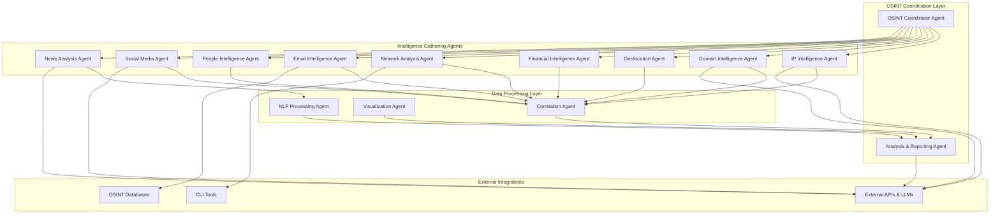

# Symbiont Multi-Agent OSINT System (Symbi-OSINT)


## Overview

This document outlines a comprehensive Open Source Intelligence (OSINT) system built using Symbiont's multi-agent architecture. The system consists of specialized agents for different intelligence domains, each equipped with appropriate tools, APIs, and security policies, now with deeply integrated Large Language Model (LLM) capabilities for advanced analysis and natural language interaction.

## System Architecture



## Agent Definitions

### 1\. OSINT Coordinator Agent

**Purpose**: Orchestrates OSINT investigations, manages task distribution, and processes natural language queries using an LLM to initiate structured investigations.

```rust
metadata {
    version = "1.1.0"
    author = "OSINT Team"
    description = "Main coordinator for OSINT investigations with NLP capabilities"
    tags = ["osint", "coordination", "investigation", "nlp", "llm"]
}

agent osint_coordinator(
    investigation_request: InvestigationRequest
) -> InvestigationPlan {
    capabilities = [
        "task_coordination",
        "agent_communication",
        "investigation_planning",
        "priority_management",
        "nlp_query_processing",
        "intent_recognition"
    ]
    
    policy investigation_security {
        allow: coordinate_agents if request.clearance_level >= "analyst"
        allow: access_sensitive_apis if request.urgency == "high"
        deny: store_pii if request.data_retention == "temporary"
        require: audit_trail for all_investigations
        audit: all_operations with digital_signature
    }
    
    with memory = "persistent", privacy = "high", security = "maximum" {
        // Use LLM to parse natural language queries into structured requests
        let structured_request = if investigation_request.is_natural_language {
            llm_parse_query({
                "system_prompt": "Convert natural language OSINT queries into structured investigation requests. Extract targets, investigation types, and priorities.",
                "user_prompt": investigation_request.natural_language_query,
                "output_format": "json",
                "schema": InvestigationRequestSchema
            })
        } else {
            investigation_request.structured_query
        };

        // Parse investigation requirements
        let targets = parse_investigation_targets(structured_request);
        let investigation_id = generate_investigation_id();
        
        // Create investigation plan
        let plan = InvestigationPlan {
            id: investigation_id,
            targets: targets,
            agents_assigned: assign_agents_by_target_type(targets),
            priority: structured_request.priority,
            timeline: calculate_timeline(targets.length),
            constraints: structured_request.constraints
        };
        
        // Initiate parallel investigations
        for target in targets {
            match target.type {
                "ip_address" => invoke_agent("ip_intelligence", target),
                "domain" => invoke_agent("domain_intelligence", target),
                "email" => invoke_agent("email_intelligence", target),
                "person" => invoke_agent("people_intelligence", target),
                "company" => invoke_agent("financial_intelligence", target),
                _ => invoke_agent("general_osint", target)
            }
        }
        
        audit_log("investigation_initiated", {
            "investigation_id": investigation_id,
            "target_count": targets.length,
            "assigned_agents": plan.agents_assigned.length
        });
        
        return plan;
    }
}
```

### 2\. IP Intelligence Agent

**Purpose**: Comprehensive IP address analysis including geolocation, reputation, ownership, and network analysis.

```rust
metadata {
    version = "1.0.0"
    author = "Network Security Team"
    description = "IP address intelligence gathering and analysis"
    tags = ["ip", "network", "geolocation", "reputation"]
}

agent ip_intelligence(
    ip_address: IPAddress,
    investigation_context: InvestigationContext
) -> IPIntelligenceReport {
    capabilities = [
        "ip_analysis",
        "geolocation",
        "reputation_check",
        "whois_lookup",
        "port_scanning",
        "threat_intelligence"
    ]
    
    policy ip_investigation_rules {
        allow: query_external_apis if ip_address.is_public
        allow: perform_active_scanning if investigation_context.scope == "authorized"
        deny: scan_private_networks if ip_address.is_private
        require: legal_authorization for active_reconnaissance
        audit: all_queries with ip_address_hash
    }
    
    with memory = "ephemeral", privacy = "medium", security = "high" {
        let report = IPIntelligenceReport::new(ip_address);
        
        try {
            // Basic IP information
            let whois_data = query_whois(ip_address);
            report.ownership = extract_ownership_info(whois_data);
            
            // Geolocation analysis
            let geo_data = query_multiple_geo_apis([
                "MaxMind GeoIP2",
                "IPGeolocation.io", 
                "IP2Location",
                "GeoJS"
            ], ip_address);
            report.geolocation = correlate_geo_data(geo_data);
            
            // Reputation checks
            let reputation_data = query_reputation_apis([
                "VirusTotal",
                "AbuseIPDB", 
                "ThreatCrowd",
                "AlienVault OTX",
                "IBM X-Force"
            ], ip_address);
            report.reputation = analyze_reputation_scores(reputation_data);
            
            // Network analysis
            if investigation_context.include_network_analysis {
                let network_info = analyze_network_block(ip_address);
                report.network_context = network_info;
                
                // Port scanning (if authorized)
                if investigation_context.authorized_scanning {
                    let open_ports = nmap_scan(ip_address, common_ports);
                    report.exposed_services = analyze_services(open_ports);
                }
            }
            
            // Threat intelligence correlation
            let threat_intel = correlate_threat_intelligence(ip_address, [
                "MISP feeds",
                "OpenIOC",
                "Yara rules",
                "Custom threat feeds"
            ]);
            report.threat_indicators = threat_intel;
            
            // Historical analysis
            let historical_data = query_passive_dns(ip_address);
            report.historical_domains = historical_data;
            
            audit_log("ip_analysis_completed", {
                "ip_address": hash(ip_address),
                "reputation_score": report.reputation.overall_score,
                "threat_level": report.threat_indicators.risk_level
            });
            
        } catch (APIError e) {
            report.errors.push(e);
            audit_log("ip_analysis_error", e.details);
        }
        
        return report;
    }
}
```

### 3\. Domain Intelligence Agent

**Purpose**: Domain name analysis including DNS records, subdomain discovery, certificate analysis, and historical data.

```rust
metadata {
    version = "1.0.0"
    author = "Domain Analysis Team"
    description = "Comprehensive domain intelligence gathering"
    tags = ["domain", "dns", "certificates", "subdomains"]
}

agent domain_intelligence(
    domain: DomainName,
    investigation_depth: InvestigationDepth
) -> DomainIntelligenceReport {
    capabilities = [
        "dns_analysis",
        "subdomain_discovery", 
        "certificate_analysis",
        "domain_reputation",
        "historical_analysis",
        "registrar_lookup"
    ]
    
    policy domain_investigation_policy {
        allow: query_public_dns if domain.is_valid
        allow: certificate_transparency_lookup for all_domains
        deny: subdomain_bruteforce if investigation_depth == "passive_only"
        require: rate_limiting for api_queries
        audit: all_domain_queries with domain_hash
    }
    
    with memory = "ephemeral", privacy = "medium", security = "high" {
        let report = DomainIntelligenceReport::new(domain);
        
        try {
            // Basic domain information
            let whois_data = query_domain_whois(domain);
            report.registration_info = parse_whois_data(whois_data);
            
            // DNS record analysis
            let dns_records = query_all_dns_records(domain, [
                "A", "AAAA", "CNAME", "MX", "TXT", "NS", "SOA", "SRV", "PTR"
            ]);
            report.dns_records = analyze_dns_records(dns_records);
            
            // Subdomain discovery
            let subdomains = discover_subdomains(domain, [
                "Certificate Transparency logs",
                "DNS bruteforcing", 
                "Search engine dorking",
                "Subdomain wordlists",
                "DNS zone transfers"
            ], investigation_depth);
            report.subdomains = validate_subdomains(subdomains);
            
            // Certificate analysis
            let certificates = query_certificate_transparency(domain);
            report.certificates = analyze_ssl_certificates(certificates);
            
            // Domain reputation
            let reputation_data = check_domain_reputation([
                "VirusTotal",
                "URLVoid",
                "Cisco Talos",
                "Google Safe Browsing",
                "PhishTank"
            ], domain);
            report.reputation = calculate_domain_reputation(reputation_data);
            
            // Historical analysis
            let historical_data = query_historical_data([
                "Wayback Machine",
                "DomainTools",
                "PassiveTotal",
                "SecurityTrails"
            ], domain);
            report.historical_analysis = analyze_domain_history(historical_data);
            
            // Related domains
            let related_domains = find_related_domains(domain, [
                "Same registrant",
                "Same IP ranges", 
                "Similar DNS patterns",
                "Certificate relationships"
            ]);
            report.related_domains = related_domains;
            
            audit_log("domain_analysis_completed", {
                "domain": hash(domain),
                "subdomain_count": report.subdomains.length,
                "reputation_score": report.reputation.overall_score
            });
            
        } catch (DNSError e) {
            report.errors.push(e);
            audit_log("domain_analysis_error", e.details);
        }
        
        return report;
    }
}
```

### 4\. Geolocation Intelligence Agent

**Purpose**: Geographic intelligence gathering and analysis for locations, coordinates, and geographic entities.

```rust
metadata {
    version = "1.0.0"
    author = "Geographic Intelligence Team"
    description = "Geolocation intelligence and analysis"
    tags = ["geolocation", "mapping", "coordinates", "geographic"]
}

agent geolocation_intelligence(
    location_query: LocationQuery,
    analysis_options: GeoAnalysisOptions
) -> GeolocationReport {
    capabilities = [
        "coordinate_analysis",
        "reverse_geocoding",
        "satellite_imagery",
        "map_analysis",
        "location_correlation",
        "timezone_analysis"
    ]
    
    policy geolocation_policy {
        allow: query_mapping_apis for public_locations
        allow: satellite_imagery_access if analysis_options.imagery_permitted
        deny: precise_coordinates if location_query.privacy_sensitive
        require: data_minimization for location_data
        audit: all_location_queries with query_hash
    }
    
    with memory = "ephemeral", privacy = "high", security = "maximum" {
        let report = GeolocationReport::new(location_query);
        
        try {
            // Coordinate normalization and validation
            let coordinates = normalize_coordinates(location_query);
            report.normalized_location = coordinates;
            
            // Multiple geocoding services for accuracy
            let geocoding_results = query_geocoding_services([
                "Google Maps Geocoding",
                "OpenStreetMap Nominatim",
                "MapBox Geocoding",
                "Here Geocoding",
                "Bing Maps"
            ], location_query);
            report.geocoding_consensus = calculate_geocoding_consensus(geocoding_results);
            
            // Reverse geocoding for coordinates
            if coordinates.is_valid() {
                let reverse_geocoding = reverse_geocode_coordinates(coordinates, [
                    "Administrative boundaries",
                    "Postal codes",
                    "Street addresses", 
                    "Points of interest"
                ]);
                report.address_details = reverse_geocoding;
            }
            
            // Timezone analysis
            let timezone_data = analyze_timezone(coordinates);
            report.timezone_info = timezone_data;
            
            // Satellite and imagery analysis
            if analysis_options.include_imagery {
                let imagery_data = query_satellite_imagery([
                    "Google Earth Engine",
                    "Sentinel Hub",
                    "Planet Labs",
                    "NASA MODIS"
                ], coordinates, analysis_options.imagery_resolution);
                report.imagery_analysis = analyze_satellite_data(imagery_data);
            }
            
            // Geospatial correlation
            let nearby_features = find_nearby_features(coordinates, [
                "Critical infrastructure",
                "Government facilities",
                "Transportation hubs",
                "Communication towers",
                "Data centers"
            ]);
            report.nearby_infrastructure = nearby_features;
            
            // Weather and environmental data
            let environmental_data = query_environmental_apis([
                "OpenWeatherMap",
                "WeatherAPI",
                "Climate data APIs"
            ], coordinates);
            report.environmental_context = environmental_data;
            
            audit_log("geolocation_analysis_completed", {
                "location_hash": hash(location_query),
                "coordinate_accuracy": report.geocoding_consensus.accuracy,
                "features_found": report.nearby_infrastructure.length
            });
            
        } catch (GeolocationError e) {
            report.errors.push(e);
            audit_log("geolocation_analysis_error", e.details);
        }
        
        return report;
    }
}
```

### 5\. Financial Intelligence Agent

**Purpose**: Financial entity investigation including company information, financial records, and economic intelligence.

```rust
metadata {
    version = "1.0.0"
    author = "Financial Intelligence Unit"
    description = "Financial entity investigation and analysis"
    tags = ["finance", "companies", "economic", "business"]
}

agent financial_intelligence(
    entity: FinancialEntity,
    investigation_scope: FinancialScope
) -> FinancialIntelligenceReport {
    capabilities = [
        "company_research",
        "financial_records",
        "regulatory_filings",
        "ownership_analysis", 
        "economic_analysis",
        "sanctions_screening"
    ]
    
    policy financial_investigation_policy {
        allow: query_public_filings for registered_entities
        allow: sanctions_database_access for compliance_screening
        deny: insider_information_access always
        require: compliance_approval for financial_data_access
        audit: all_financial_queries with entity_hash
    }
    
    with memory = "ephemeral", privacy = "maximum", security = "maximum" {
        let report = FinancialIntelligenceReport::new(entity);
        
        try {
            // Company registration and basic information
            let company_data = query_company_registries([
                "SEC EDGAR",
                "Companies House (UK)",
                "D&B Hoovers",
                "OpenCorporates",
                "Local business registries"
            ], entity);
            report.company_profile = analyze_company_data(company_data);
            
            // Financial filings and reports
            let financial_filings = query_financial_databases([
                "SEC filings",
                "Annual reports",
                "Quarterly statements",
                "Proxy statements",
                "Form 8-K filings"
            ], entity);
            report.financial_history = analyze_financial_filings(financial_filings);
            
            // Ownership and subsidiary analysis
            let ownership_structure = analyze_ownership([
                "Beneficial ownership",
                "Subsidiary relationships",
                "Parent companies",
                "Joint ventures",
                "Partnerships"
            ], entity);
            report.ownership_analysis = ownership_structure;
            
            // Sanctions and watchlist screening
            let sanctions_results = screen_sanctions_lists([
                "OFAC SDN List",
                "EU Sanctions List", 
                "UN Sanctions List",
                "PEP databases",
                "Adverse media"
            ], entity);
            report.sanctions_screening = sanctions_results;
            
            // Financial performance analysis
            let performance_metrics = calculate_financial_metrics(
                report.financial_history
            );
            report.performance_analysis = performance_metrics;
            
            // Related entity discovery
            let related_entities = find_related_entities(entity, [
                "Shared addresses",
                "Common officers",
                "Similar business activities",
                "Financial relationships"
            ]);
            report.related_entities = related_entities;
            
            // Risk assessment
            let risk_assessment = calculate_financial_risk(
                report.sanctions_screening,
                report.financial_history,
                report.ownership_analysis
            );
            report.risk_assessment = risk_assessment;
            
            audit_log("financial_analysis_completed", {
                "entity_hash": hash(entity),
                "risk_score": report.risk_assessment.overall_score,
                "sanctions_hits": report.sanctions_screening.hits.length
            });
            
        } catch (FinancialAPIError e) {
            report.errors.push(e);
            audit_log("financial_analysis_error", e.details);
        }
        
        return report;
    }
}
```

### 6\. Network Analysis Agent

**Purpose**: Network infrastructure analysis, topology mapping, and network security assessment.

```rust
metadata {
    version = "1.0.0"
    author = "Network Analysis Team"  
    description = "Network infrastructure analysis and mapping"
    tags = ["network", "infrastructure", "topology", "security"]
}

agent network_analysis(
    network_target: NetworkTarget,
    scan_parameters: ScanParameters
) -> NetworkAnalysisReport {
    capabilities = [
        "network_discovery",
        "port_scanning",
        "service_enumeration",
        "topology_mapping",
        "vulnerability_assessment",
        "traffic_analysis"
    ]
    
    policy network_scanning_policy {
        allow: passive_scanning for all_networks
        allow: active_scanning if scan_parameters.authorized == true
        deny: aggressive_scanning if network_target.is_critical_infrastructure
        require: legal_authorization for active_reconnaissance
        audit: all_network_activities with target_hash
    }
    
    with memory = "ephemeral", privacy = "medium", security = "high" {
        let report = NetworkAnalysisReport::new(network_target);
        
        try {
            // Passive network discovery
            let passive_discovery = perform_passive_discovery([
                "DNS enumeration",
                "WHOIS analysis", 
                "Certificate transparency",
                "Search engine reconnaissance",
                "Social media mentions"
            ], network_target);
            report.passive_intelligence = passive_discovery;
            
            // Active network discovery (if authorized)
            if scan_parameters.authorized {
                let active_discovery = perform_active_discovery([
                    "Ping sweeps",
                    "Port scanning",
                    "Service enumeration",
                    "OS fingerprinting",
                    "Route tracing"
                ], network_target, scan_parameters);
                report.active_discovery = active_discovery;
            }
            
            // Network topology mapping
            let topology = map_network_topology(
                report.passive_intelligence,
                report.active_discovery
            );
            report.network_topology = topology;
            
            // Service analysis
            let services = analyze_discovered_services(
                report.active_discovery.services
            );
            report.service_analysis = services;
            
            // Vulnerability assessment
            let vulnerabilities = assess_vulnerabilities([
                "CVE database lookup",
                "Service version analysis",
                "Configuration assessment",
                "Security headers analysis"
            ], report.service_analysis);
            report.vulnerability_assessment = vulnerabilities;
            
            // Network security analysis
            let security_analysis = analyze_network_security([
                "Firewall detection",
                "IDS/IPS detection", 
                "Load balancer analysis",
                "SSL/TLS configuration",
                "Security headers"
            ], network_target);
            report.security_analysis = security_analysis;
            
            // Traffic pattern analysis (passive)
            let traffic_patterns = analyze_traffic_patterns(
                network_target,
                scan_parameters.monitoring_duration
            );
            report.traffic_analysis = traffic_patterns;
            
            audit_log("network_analysis_completed", {
                "target_hash": hash(network_target),
                "hosts_discovered": report.active_discovery.hosts.length,
                "vulnerabilities_found": report.vulnerability_assessment.high_risk.length
            });
            
        } catch (NetworkError e) {
            report.errors.push(e);
            audit_log("network_analysis_error", e.details);
        }
        
        return report;
    }
}
```

### 7\. Email Intelligence Agent

**Purpose**: Email address investigation including validation, reputation, breach analysis, and related account discovery.

```rust
metadata {
    version = "1.0.0"
    author = "Email Intelligence Team"
    description = "Email address investigation and analysis"
    tags = ["email", "validation", "breach", "reputation"]
}

agent email_intelligence(
    email_address: EmailAddress,
    investigation_depth: EmailInvestigationDepth
) -> EmailIntelligenceReport {
    capabilities = [
        "email_validation",
        "breach_analysis", 
        "reputation_check",
        "domain_analysis",
        "social_media_correlation",
        "account_discovery"
    ]
    
    policy email_investigation_policy {
        allow: validate_email_format for all_emails
        allow: breach_database_lookup if investigation_depth >= "standard"
        deny: active_email_probing if email_address.privacy_protected
        require: gdpr_compliance for eu_email_addresses
        audit: all_email_queries with email_hash
    }
    
    with memory = "ephemeral", privacy = "maximum", security = "high" {
        let report = EmailIntelligenceReport::new(email_address);
        
        try {
            // Email validation and analysis
            let validation_results = validate_email([
                "Syntax validation",
                "Domain existence check",
                "MX record validation", 
                "Disposable email detection",
                "Role account detection"
            ], email_address);
            report.validation = validation_results;
            
            // Breach database analysis
            let breach_data = query_breach_databases([
                "HaveIBeenPwned",
                "DeHashed",
                "LeakCheck",
                "Snusbase",
                "Intelligence X"
            ], email_address);
            report.breach_history = analyze_breach_data(breach_data);
            
            // Email reputation analysis
            let reputation_data = check_email_reputation([
                "Sender reputation services",
                "Spam databases",
                "Phishing databases",
                "Malware distribution lists"
            ], email_address);
            report.reputation = reputation_data;
            
            // Domain analysis for email provider
            let domain = extract_domain(email_address);
            let domain_intel = query_agent("domain_intelligence", domain);
            report.domain_intelligence = domain_intel;
            
            // Social media account correlation
            let social_accounts = discover_social_accounts([
                "Facebook",
                "Twitter", 
                "LinkedIn",
                "Instagram",
                "GitHub",
                "Reddit"
            ], email_address);
            report.social_media_accounts = social_accounts;
            
            // Related account discovery
            let related_accounts = find_related_accounts([
                "Username variations",
                "Similar email patterns",
                "Shared breach data",
                "Social media connections"
            ], email_address);
            report.related_accounts = related_accounts;
            
            // Metadata analysis
            let metadata_analysis = analyze_email_metadata(
                email_address,
                investigation_depth
            );
            report.metadata_analysis = metadata_analysis;
            
            audit_log("email_analysis_completed", {
                "email_hash": hash(email_address),
                "breaches_found": report.breach_history.total_breaches,
                "social_accounts_found": report.social_media_accounts.length
            });
            
        } catch (EmailAPIError e) {
            report.errors.push(e);
            audit_log("email_analysis_error", e.details);
        }
        
        return report;
    }
}
```

### 8\. People Intelligence Agent

**Purpose**: Investigation of individuals including name analysis, biographical information, and identity correlation.

```rust
metadata {
    version = "1.0.0"
    author = "People Intelligence Team"
    description = "Individual person investigation and analysis"
    tags = ["people", "names", "identity", "biographical"]
}

agent people_intelligence(
    person_query: PersonQuery,
    investigation_scope: PersonInvestigationScope
) -> PeopleIntelligenceReport {
    capabilities = [
        "name_analysis",
        "biographical_research",
        "public_records_search",
        "professional_background",
        "social_media_analysis",
        "identity_correlation"
    ]
    
    policy people_investigation_policy {
        allow: public_records_search for legitimate_investigations
        allow: social_media_analysis if person_query.consent_obtained
        deny: private_data_access if investigation_scope == "preliminary"
        require: legal_authority for detailed_background_checks
        require: privacy_compliance for all_personal_data
        audit: all_people_queries with person_hash
    }
    
    with memory = "ephemeral", privacy = "maximum", security = "maximum" {
        let report = PeopleIntelligenceReport::new(person_query);
        
        try {
            // Name analysis and variations
            let name_analysis = analyze_name_variations([
                "Common nicknames",
                "Alternative spellings",
                "Cultural name variations",
                "Maiden names",
                "Professional names"
            ], person_query.name);
            report.name_analysis = name_analysis;
            
            // Public records search
            let public_records = search_public_records([
                "Voter registrations",
                "Property records",
                "Business registrations",
                "Court records",
                "Professional licenses"
            ], person_query, investigation_scope);
            report.public_records = filter_privacy_compliant(public_records);
            
            // Professional background
            let professional_info = research_professional_background([
                "LinkedIn profiles",
                "Company directories",
                "Professional associations",
                "Academic publications",
                "Speaking engagements"
            ], person_query);
            report.professional_background = professional_info;
            
            // Social media presence analysis
            if investigation_scope.include_social_media {
                let social_presence = analyze_social_media_presence([
                    "Facebook",
                    "Twitter",
                    "LinkedIn", 
                    "Instagram",
                    "TikTok",
                    "YouTube"
                ], person_query);
                report.social_media_presence = social_presence;
            }
            
            // Educational background
            let education_data = research_educational_background([
                "University records",
                "Alumni directories",
                "Academic publications",
                "Degree verification services"
            ], person_query);
            report.educational_background = education_data;
            
            // Address history and location intelligence
            let location_history = analyze_location_history(
                report.public_records,
                report.social_media_presence
            );
            report.location_intelligence = location_history;
            
            // Identity correlation and verification
            let identity_correlation = correlate_identity_data([
                report.public_records,
                report.professional_background,
                report.social_media_presence,
                report.educational_background
            ]);
            report.identity_correlation = identity_correlation;
            
            // Associated entities and relationships
            let relationships = discover_relationships([
                "Family members",
                "Business associates", 
                "Social connections",
                "Professional networks"
            ], person_query, report);
            report.relationships = relationships;
            
            audit_log("people_analysis_completed", {
                "person_hash": hash(person_query),
                "records_found": report.public_records.length,
                "confidence_score": report.identity_correlation.confidence
            });
            
        } catch (PrivacyError e) {
            report.errors.push(e);
            audit_log("people_analysis_privacy_error", e.details);
        }
        
        return report;
    }
}
```

### 9\. Social Media Intelligence Agent

**Purpose**: Social media platform analysis, content analysis, and social network mapping, with LLM-powered context and intent analysis.

```rust
metadata {
    version = "1.1.0"
    author = "Social Media Intelligence Team"
    description = "Social media platform analysis and monitoring with LLM insights"
    tags = ["social_media", "content_analysis", "networks", "monitoring", "llm"]
}

agent social_media_intelligence(
    social_query: SocialMediaQuery,
    analysis_parameters: SocialAnalysisParameters
) -> SocialMediaReport {
    capabilities = [
        "platform_analysis",
        "content_monitoring",
        "sentiment_analysis",
        "network_mapping",
        "trend_analysis",
        "influence_measurement",
        "llm_content_understanding"
    ]
    
    policy social_media_policy {
        allow: public_content_analysis for all_platforms
        allow: api_access if analysis_parameters.api_authorized
        deny: private_content_access always
        require: rate_limiting for api_requests
        require: content_filtering for inappropriate_material
        audit: all_social_media_queries with query_hash
    }
    
    with memory = "ephemeral", privacy = "high", security = "medium" {
        let report = SocialMediaReport::new(social_query);
        
        try {
            // Multi-platform content discovery
            let content_discovery = discover_content([
                "Twitter/X",
                "Facebook", 
                "Instagram",
                "LinkedIn",
                "TikTok",
                "YouTube",
                "Reddit",
                "Telegram"
            ], social_query, analysis_parameters);
            report.content_discovery = content_discovery;
            
            // Use LLM for context understanding on discovered content
            for post in report.content_discovery.posts {
                let content_analysis = llm_analyze_social_content({
                    "system_prompt": "Analyze this social media post for: 1) Intent and sentiment, 2) Potential threats or concerning content, 3) Network relationships implied, 4) Credibility indicators",
                    "content": post.text,
                    "metadata": post.metadata,
                    "context": social_query.context
                });
                
                post.llm_insights = content_analysis;
            }
            
            // Social network mapping
            let network_mapping = map_social_networks([
                "Follower relationships",
                "Interaction patterns",
                "Shared content",
                "Group memberships",
                "Common connections"
            ], report.content_discovery);
            report.network_mapping = network_mapping;
            
            // ... other analysis steps ...
            
            audit_log("social_media_analysis_completed", {
                "query_hash": hash(social_query),
                "platforms_analyzed": report.content_discovery.platforms.length,
                "content_items_found": report.content_discovery.total_items
            });
            
        } catch (SocialMediaAPIError e) {
            report.errors.push(e);
            audit_log("social_media_analysis_error", e.details);
        }
        
        return report;
    }
}
```

### 10\. News Analysis Agent

**Purpose**: News monitoring, sentiment analysis, and media intelligence gathering, enhanced with LLM-based summarization and deep content analysis.

```rust
metadata {
    version = "1.1.0"
    author = "Media Intelligence Team"
    description = "News analysis and media intelligence gathering with LLM summarization"
    tags = ["news", "media", "sentiment", "monitoring", "llm"]
}

agent news_analysis(
    news_query: NewsQuery,
    monitoring_parameters: NewsMonitoringParameters
) -> NewsAnalysisReport {
    capabilities = [
        "news_monitoring",
        "sentiment_analysis",
        "source_analysis",
        "trend_detection",
        "fact_checking",
        "media_bias_detection",
        "llm_content_analysis",
        "llm_summarization"
    ]
    
    policy news_analysis_policy {
        allow: public_news_access for all_sources
        allow: premium_api_access if monitoring_parameters.premium_authorized
        deny: paywalled_content_bypass always
        require: source_attribution for all_content
        audit: all_news_queries with query_hash
    }
    
    with memory = "ephemeral", privacy = "low", security = "medium" {
        let report = NewsAnalysisReport::new(news_query);
        
        try {
            // Multi-source news aggregation
            let news_aggregation = aggregate_news_sources([
                "Reuters",
                "Associated Press",
                "BBC News",
                "Google News",
                "AllSides",
                "NewsAPI",
                "Event Registry",
                "GDELT Project"
            ], news_query, monitoring_parameters);
            report.news_aggregation = news_aggregation;
            
            // Use LLM for advanced content analysis on each article
            for article in report.news_aggregation.articles {
                let llm_analysis = llm_analyze_content({
                    "system_prompt": "Analyze this news article for: 1) Key entities and their relationships, 2) Potential security implications, 3) Credibility assessment, 4) Bias detection",
                    "content": article.content,
                    "metadata": article.metadata
                });
                
                article.llm_analysis = llm_analysis;
            }
            
            // Generate LLM-powered comprehensive summary
            let comprehensive_summary = llm_summarize({
                "system_prompt": "Create a comprehensive intelligence summary from multiple news sources. Focus on: timeline of events, key players, potential threats, and credibility assessment.",
                "articles": report.news_aggregation.articles,
                "max_tokens": 2000
            });
            
            report.llm_summary = comprehensive_summary;
            
            audit_log("news_analysis_completed", {
                "query_hash": hash(news_query),
                "articles_analyzed": report.news_aggregation.total_articles,
                "sources_count": report.news_aggregation.sources.length
            });
            
        } catch (NewsAPIError e) {
            report.errors.push(e);
            audit_log("news_analysis_error", e.details);
        }
        
        return report;
    }
}
```

## Supporting Agents

### 11\. Analysis & Reporting Agent

**Purpose**: Correlates intelligence from all specialized agents, utilizes an LLM for deep analysis and synthesis, and generates comprehensive reports.

```rust
metadata {
    version = "1.1.0"
    author = "Intelligence Analysis Team"
    description = "Cross-domain intelligence correlation and reporting with LLM synthesis"
    tags = ["analysis", "correlation", "reporting", "intelligence", "llm"]
}

agent analysis_reporting(
    investigation_results: Vec<IntelligenceReport>,
    reporting_requirements: ReportingRequirements
) -> ComprehensiveIntelligenceReport {
    capabilities = [
        "data_correlation",
        "pattern_recognition",
        "report_generation",
        "visualization",
        "risk_assessment",
        "recommendation_engine",
        "llm_analysis",
        "threat_assessment"
    ]
    
    policy analysis_reporting_policy {
        allow: cross_reference_data from authorized_agents
        allow: generate_reports if reporting_requirements.authorized
        deny: expose_sensitive_sources in public_reports
        require: classification_handling for sensitive_intelligence
        audit: all_analysis_operations with correlation_hash
    }
    
    with memory = "persistent", privacy = "maximum", security = "maximum" {
        let comprehensive_report = ComprehensiveIntelligenceReport::new();
        
        try {
            // Sanitize data before LLM processing
            let sanitized_data = sanitize_for_llm(investigation_results);

            // Use LLM for intelligent analysis and synthesis
            let llm_analysis_report = llm_analyze({
                "system_prompt": "You are an expert OSINT analyst. Analyze the provided intelligence data and identify patterns, threats, and relationships, and generate a comprehensive summary.",
                "user_prompt": reporting_requirements.analysis_prompt,
                "data": sanitized_data,
                "max_tokens": 4000,
                "temperature": 0.1 // Low temperature for factual analysis
            });

            // Validate and integrate LLM output
            comprehensive_report.llm_analysis = validate_llm_output(llm_analysis_report.analysis);
            comprehensive_report.executive_summary = llm_analysis_report.summary;
            
            // ... existing correlation and analysis steps ...
            
            audit_log("comprehensive_analysis_completed", {
                "investigation_sources": investigation_results.length,
                "entities_correlated": comprehensive_report.entity_correlations.length,
                "risk_level": comprehensive_report.risk_assessment.overall_level
            });
            
        } catch (AnalysisError e) {
            comprehensive_report.errors.push(e);
            audit_log("analysis_error", e.details);
        }
        
        return comprehensive_report;
    }
}
```

### 12\. NLP Processing Agent

**Purpose**: Natural language processing for text analysis, entity extraction, and sentiment analysis. (This agent can be used by other agents for specific NLP tasks.)

```rust
metadata {
    version = "1.0.0"
    author = "NLP Team"
    description = "Natural language processing for intelligence analysis"
    tags = ["nlp", "text_analysis", "entity_extraction", "sentiment"]
}

agent nlp_processing(
    text_data: TextData,
    processing_options: NLPProcessingOptions
) -> NLPAnalysisReport {
    capabilities = [
        "entity_extraction",
        "sentiment_analysis",
        "language_detection",
        "topic_modeling",
        "relationship_extraction",
        "summarization"
    ]
    
    policy nlp_processing_policy {
        allow: process_public_text for all_sources
        deny: process_classified_documents without_clearance
        require: data_sanitization for personal_information
        audit: all_nlp_operations with content_hash
    }
    
    with memory = "ephemeral", privacy = "medium", security = "medium" {
        let report = NLPAnalysisReport::new(text_data);
        
        try {
            // Language detection and preprocessing
            let language_analysis = detect_and_preprocess([
                "Language identification",
                "Text normalization",
                "Tokenization",
                "Stop word removal",
                "Stemming/Lemmatization"
            ], text_data);
            report.language_analysis = language_analysis;
            
            // Named entity recognition
            let entity_extraction = extract_entities([
                "Person names",
                "Organizations",
                "Locations", 
                "Dates and times",
                "Money and percentages",
                "Phone numbers",
                "Email addresses",
                "URLs and domains"
            ], text_data);
            report.entities = entity_extraction;
            
            // Sentiment and emotion analysis
            let sentiment_analysis = analyze_sentiment_emotions([
                "Overall sentiment",
                "Emotion classification",
                "Confidence scores",
                "Subjectivity analysis",
                "Intensity measurement"
            ], text_data);
            report.sentiment_analysis = sentiment_analysis;
            
            // Topic modeling and classification
            let topic_analysis = analyze_topics([
                "Topic extraction",
                "Content categorization",
                "Theme identification",
                "Keyword extraction",
                "Document clustering"
            ], text_data);
            report.topic_analysis = topic_analysis;
            
            // Relationship extraction
            let relationship_extraction = extract_relationships([
                "Entity relationships",
                "Dependency parsing",
                "Event extraction",
                "Causal relationships",
                "Temporal relationships"
            ], text_data, report.entities);
            report.relationships = relationship_extraction;
            
            // Text summarization
            if processing_options.include_summarization {
                let summarization = generate_summaries([
                    "Extractive summary",
                    "Abstractive summary",
                    "Key points extraction",
                    "Executive summary"
                ], text_data);
                report.summarization = summarization;
            }
            
            audit_log("nlp_processing_completed", {
                "text_length": text_data.content.length,
                "entities_found": report.entities.total_count,
                "sentiment_score": report.sentiment_analysis.overall_score
            });
            
        } catch (NLPError e) {
            report.errors.push(e);
            audit_log("nlp_processing_error", e.details);
        }
        
        return report;
    }
}
```

## Usage Examples

### Starting an Investigation with a Natural Language Query

```bash
# Start a comprehensive investigation using a simple sentence
curl -X POST http://localhost:8080/api/v1/investigations/start \
 -H "Content-Type: application/json" \
 -d '{
   "query": "Investigate the domain evilcorp.com and the IP 8.8.8.8 for potential threats. High priority.",
   "requester": "analyst@symbiont.com"
 }'

# Check investigation status
curl http://localhost:8080/api/v1/investigations/12345

# Retrieve the final report
curl http://localhost:8080/api/v1/investigations/12345/report
```

### Direct Agent Invocation for Email Analysis

```bash
# Directly trigger the email intelligence agent
curl -X POST http://localhost:8080/api/v1/agents/email-intelligence/analyze \
 -H "Content-Type: application/json" \
 -d '{
   "email_address": "suspicious@example.com",
   "investigation_depth": "comprehensive"
 }'
```

### Multi-target Structured Investigation

```bash
# A more complex, structured investigation request
curl -X POST http://localhost:8080/api/v1/investigations/start-structured \
 -H "Content-Type: application/json" \
 -d '{
   "targets": [
     {"type": "ip_address", "value": "1.1.1.1"},
     {"type": "domain", "value": "shady-site.net"},
     {"type": "email", "value": "contact@shady-site.net"},
     {"type": "person", "value": "Jane Smith"}
   ],
   "investigation_type": "comprehensive",
   "priority": "high",
   "correlation_enabled": true
 }'
```
## Future Improvements  

### 1. Enhanced Agent Capabilities  
* **Human-in-the-Loop Agent:** Introduce an agent to manage tasks that require human review, judgment, or authorization. This would allow an analyst to directly steer or validate complex investigations.
* **Data Transformation Agent:** Add a specialized agent in the "Data Processing Layer" responsible for normalizing, cleaning, and transforming diverse data formats (e.g., XML, CSV, unstructured text) into a unified model for easier analysis.
* **Proactive Threat Monitoring Agent:** Instead of only reacting to investigation requests, an agent could proactively monitor sources (dark web forums, threat feeds) for keywords or indicators, automatically triggering investigations when a threat is detected.

### 2. Deeper LLM & AI Integration  
* **Autonomous Strategy Generation:** Empower the `OSINT Coordinator Agent` to use an LLM to dynamically generate an investigation plan based on the initial findings, rather than following a predefined workflow. For instance, if the `IP Intelligence Agent` finds an IP linked to a specific hosting provider known for malicious activity, the LLM could suggest prioritizing a deep dive into that provider's network block.
* **Visual Intelligence Agent:** The `Visualization Agent` could be enhanced to use generative AI (including LLMs) to not just create charts, but to automatically generate dynamic dashboards, link analysis graphs, and geospatial maps based on a natural language prompt from an analyst (e.g., "Show me the relationship between all domains hosted on this IP and their known owners").
* **Adversarial Emulation:** Use LLMs to simulate adversarial communication patterns or phishing email styles based on intelligence gathered about a specific threat actor. This can help in training detection models and analysts.

### 3. Architectural and Security Refinements  
* **More Granular Caching:** Implement caching mechanisms within each intelligence-gathering agent. For example, the `Domain Intelligence Agent` could cache DNS records for a configurable TTL (Time-To-Live) to reduce redundant external API calls and improve speed.
* **Dynamic Security Policies:** Evolve the security policies from static rules to a dynamic model. An agent's permissions could be temporarily elevated or restricted based on the real-time risk score of an ongoing investigation, providing a more adaptive security posture.
* **Feedback Loops for Self-Improvement:** Implement a feedback mechanism where the final report's accuracy or utility (as rated by an analyst) is used to fine-tune the LLM prompts and agent decision-making models over time, allowing the system to learn and improve.

