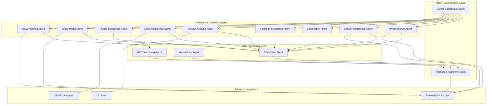

# Symbiont Multi-Agent OSINT System (Symbi-OSINT)

## Overview

This document outlines a comprehensive Open Source Intelligence (OSINT) system built using Symbiont's multi-agent architecture. The system consists of specialized agents for different intelligence domains, each equipped with appropriate tools, APIs, and security policies, now with deeply integrated Large Language Model (LLM) capabilities for advanced analysis and natural language interaction.

## System Architecture

## Agent Definitions

### 1\. OSINT Coordinator Agent

**Purpose**: Orchestrates OSINT investigations, manages task distribution, and processes natural language queries using an LLM to initiate structured investigations.

See [`agents/osint_coordinator.symbi`](agents/osint_coordinator.symbi)

### 2\. IP Intelligence Agent

**Purpose**: Comprehensive IP address analysis including geolocation, reputation, ownership, and network analysis.

See [`agents/ip_intelligence.symbi`](agents/ip_intelligence.symbi)

### 3\. Domain Intelligence Agent

**Purpose**: Domain name analysis including DNS records, subdomain discovery, certificate analysis, and historical data.

See [`agents/domain_intelligence.symbi`](agents/domain_intelligence.symbi)

### 4\. Geolocation Intelligence Agent

**Purpose**: Geographic intelligence gathering and analysis for locations, coordinates, and geographic entities.

See [`agents/geolocation_intelligence.symbi`](agents/geolocation_intelligence.symbi)

### 5\. Financial Intelligence Agent

**Purpose**: Financial entity investigation including company information, financial records, and economic intelligence.

See [`agents/financial_intelligence.symbi`](agents/financial_intelligence.symbi)

### 6\. Network Analysis Agent

**Purpose**: Network infrastructure analysis, topology mapping, and network security assessment.

See [`agents/network_analysis.symbi`](agents/network_analysis.symbi)

### 7\. Email Intelligence Agent

**Purpose**: Email address investigation including validation, reputation, breach analysis, and related account discovery.

See [`agents/email_intelligence.symbi`](agents/email_intelligence.symbi)

### 8\. People Intelligence Agent

**Purpose**: Investigation of individuals including name analysis, biographical information, and identity correlation.

See [`agents/people_intelligence.symbi`](agents/people_intelligence.symbi)

### 9\. Social Media Intelligence Agent

**Purpose**: Social media platform analysis, content analysis, and social network mapping, with LLM-powered context and intent analysis.

See [`agents/social_media_intelligence.symbi`](agents/social_media_intelligence.symbi)

### 10\. News Analysis Agent

**Purpose**: News monitoring, sentiment analysis, and media intelligence gathering, enhanced with LLM-based summarization and deep content analysis.

See [`agents/news_analysis.symbi`](agents/news_analysis.symbi)

## Supporting Agents

### 11\. Analysis & Reporting Agent

**Purpose**: Correlates intelligence from all specialized agents, utilizes an LLM for deep analysis and synthesis, and generates comprehensive reports.

See [`agents/analysis_reporting.symbi`](agents/analysis_reporting.symbi)

### 12\. NLP Processing Agent

**Purpose**: Natural language processing for text analysis, entity extraction, and sentiment analysis. (This agent can be used by other agents for specific NLP tasks.)

See [`agents/nlp_processing.symbi`](agents/nlp_processing.symbi)

## Usage Examples

See [`agents/usage_examples.symbi`](agents/usage_examples.symbi)
## Future Improvements  

### 1. Enhanced Agent Capabilities  
* **Human-in-the-Loop Agent:** Introduce an agent to manage tasks that require human review, judgment, or authorization. This would allow an analyst to directly steer or validate complex investigations.
* **Data Transformation Agent:** Add a specialized agent in the "Data Processing Layer" responsible for normalizing, cleaning, and transforming diverse data formats (e.g., XML, CSV, unstructured text) into a unified model for easier analysis.
* **Proactive Threat Monitoring Agent:** Instead of only reacting to investigation requests, an agent could proactively monitor sources (dark web forums, threat feeds) for keywords or indicators, automatically triggering investigations when a threat is detected.

### 2. Deeper LLM & AI Integration  
* **Autonomous Strategy Generation:** Empower the `OSINT Coordinator Agent` to use an LLM to dynamically generate an investigation plan based on the initial findings, rather than following a predefined workflow. For instance, if the `IP Intelligence Agent` finds an IP linked to a specific hosting provider known for malicious activity, the LLM could suggest prioritizing a deep dive into that provider's network block.
* **Visual Intelligence Agent:** The `Visualization Agent` could be enhanced to use generative AI (including LLMs) to not just create charts, but to automatically generate dynamic dashboards, link analysis graphs, and geospatial maps based on a natural language prompt from an analyst (e.g., "Show me the relationship between all domains hosted on this IP and their known owners").
* **Adversarial Emulation:** Use LLMs to simulate adversarial communication patterns or phishing email styles based on intelligence gathered about a specific threat actor. This can help in training detection models and analysts.

### 3. Architectural and Security Refinements  
* **More Granular Caching:** Implement caching mechanisms within each intelligence-gathering agent. For example, the `Domain Intelligence Agent` could cache DNS records for a configurable TTL (Time-To-Live) to reduce redundant external API calls and improve speed.
* **Dynamic Security Policies:** Evolve the security policies from static rules to a dynamic model. An agent's permissions could be temporarily elevated or restricted based on the real-time risk score of an ongoing investigation, providing a more adaptive security posture.
* **Feedback Loops for Self-Improvement:** Implement a feedback mechanism where the final report's accuracy or utility (as rated by an analyst) is used to fine-tune the LLM prompts and agent decision-making models over time, allowing the system to learn and improve.

